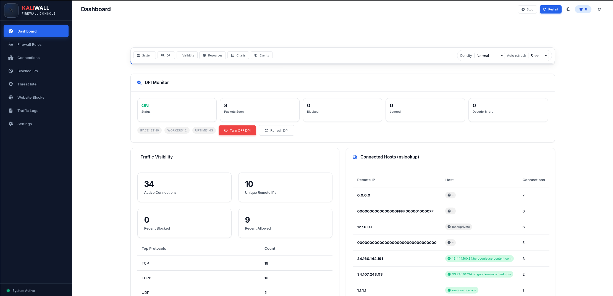

<div align="center">

<br/>


<br/><br/>

<p align="center">
  
  &nbsp;
  
  &nbsp;
  
  &nbsp;
  
</p>

<p align="center">
  
  &nbsp;
  
  &nbsp;
  
  &nbsp;
  
</p>

<br/>

> **KaliWall** is a powerful open-source firewall platform for Linux.  
> It combines **live firewall control**, **traffic visibility**, **GeoIP telemetry**,  
> **threat intelligence**, and **DPI controls** through a sleek web dashboard and CLI.

<br/>

[🚀 Quick Start](#-quick-start) · [✨ Features](#-features) · [🔌 API](#-api-highlights) · [🌱 Open Source](#-open-source)

</div>

---

<br/>

## 🖥️ Dashboard Preview

<div align="center">
  
  <br/>
  <sub>KaliWall Web Dashboard — running at <code>http://localhost:8080</code></sub>
</div>

---

<br/>

## ✨ Features

<br/>

### 🔐 Core Firewall

| Capability | Details |
|---|---|
| **Rule Lifecycle** | Create · Update · Validate · Analyze · Toggle · Delete |
| **Backends** | `iptables` · `nftables` · `ufw` · Memory fallback |
| **Runtime Switch** | Hot-swap backend via API or dashboard |
| **Safe Defaults** | Automatic rule seeding on first run |

<br/>

### 🚫 Blocklists and Access Control

- 🔴 Block / unblock **IP addresses** with reasons and full history
- 🌐 Block / unblock **websites and domains**
- 💾 Persistent blocked entries via local database storage

<br/>

### 📡 Monitoring and Visibility

- 📊 **Live traffic logs** and streaming events via SSE
- 🔗 **Active connection** visibility and system health stats
- ⚡ Firewall **event stream** for near real-time UI updates
- 🌍 **DNS visibility** with cache stats, manual refresh, and cache clear endpoint

<br/>

### 🧠 Analytics and Intelligence

- 📈 Bandwidth and analytics metrics with **stream endpoint**
- 🦠 **VirusTotal** integration for IP reputation lookups
- 🗂️ Threat cache listing and API key management
- 🗺️ **GeoIP attack telemetry** with stream support

<br/>

### 🌍 GeoIP Support

```
✅  MaxMind .mmdb        →  GeoLite2-City.mmdb
✅  IP2Location CSV      →  IP2LOCATION-LITE-DB1.CSV
✅  Auto path resolution →  No manual config needed
```

<br/>

### 🔬 DPI Pipeline

- 🔁 Optional DPI pipeline with **runtime on/off controls**
- ⚙️ Configurable interface, workers, BPF filter, promiscuous mode, and rate limiting
- 📍 DPI status endpoint for **dashboard observability**

<br/>

### 🖥️ UX and Tooling

- 🎨 **FortiGate-inspired** web UI in plain HTML/CSS/JS
- ⌨️ Full **CLI client** for rules, blocklists, status, logs, threats, and connections
- 🌑 Background **daemon** start via startup script

---

<br/>

## 🚀 Quick Start

<br/>

### 📋 Prerequisites

<p>
  
  &nbsp;
  
  &nbsp;
  
</p>

<br/>

### ⚡ Setup

```bash
git clone https://github.com/sujallamichhane18/KaliWall.git
cd KaliWall
chmod +x setup.sh && ./setup.sh
```

<br/>

### ▶️ Run

**Background mode** *(default)*:
```bash
chmod +x start.sh && ./start.sh
```

**Foreground mode**:
```bash
./start.sh --foreground
```

<br/>

<div align="center">
  
</div>

---

<br/>

## 🔌 API Highlights

**Base URL:** `http://localhost:8080/api/v1`

| Category | Endpoints |
|---|---|
| 📜 **Rules** | `/rules` · `/rules/{id}` · `/rules/validate` · `/rules/analyze` |
| 🔥 **Firewall Engine** | `/firewall/engine` · `/firewall/logs` |
| 📡 **Traffic & Logs** | `/logs` · `/logs/stream` · `/events` · `/events/stream` · `/traffic/visibility` |
| 🌐 **Network / DNS** | `/connections` · `/dns/stats` · `/dns/refresh` · `/dns/cache` |
| 🦠 **Threat Intel** | `/threat/apikey` · `/threat/check/{ip}` · `/threat/cache` |
| 📊 **Analytics** | `/analytics` · `/analytics/stream` |
| 🗺️ **GeoIP** | `/geo/attacks` · `/geo/stream` |
| 🔬 **DPI** | `/dpi/status` · `/dpi/control` |
| 🚫 **Blocklists** | `/blocked` · `/blocked/{ip}` · `/websites` · `/websites/{domain}` |

---

<br/>

## ⚙️ Configuration

```
📁 GeoLite2-City.mmdb
📁 IP2LOCATION-LITE-DB1.CSV
```

```bash
./kaliwall --geo-db /path/to/GeoLite2-City.mmdb
./kaliwall --geo-db /path/to/IP2LOCATION-LITE-DB1.CSV
```

---

<br/>

## 🌱 Open Source

<div align="center">
  
  &nbsp;
  
  &nbsp;
  
</div>

<br/>

- 🐛 **Report bugs** in [GitHub Issues](https://github.com/sujallamichhane18/KaliWall/issues)
- 🔧 **Open pull requests** for fixes, docs, and enhancements
- 🎯 Keep changes **focused** and **well-tested**

---

<br/>

## 🛠️ Built With

<p align="center">
  
  &nbsp;
  
  &nbsp;
  
  &nbsp;
  
  &nbsp;
  
  &nbsp;
  
</p>

---

<br/>

<div align="center">

<a href="https://github.com/sujallamichhane18/KaliWall/stargazers">
  
</a>
&nbsp;&nbsp;
<a href="https://github.com/sujallamichhane18/KaliWall/network/members">
  
</a>
&nbsp;&nbsp;
<a href="https://github.com/sujallamichhane18/KaliWall/watchers">
  
</a>

<br/><br/>

<sub>If KaliWall helped you, consider giving it a ⭐ — it means the world!</sub>

<br/><br/>

---

<h3>Made with ❤️ by <a href="https://github.com/sujallamichhane18">Sujal Lamichhane</a></h3>

<br/>

</div>
